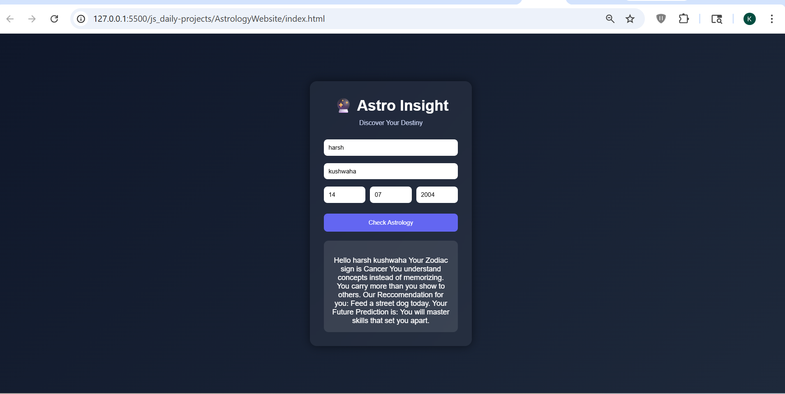

# Astrology Website

## 📌 Description
The **Astrology Website** is a frontend practice project built using **HTML, CSS, and JavaScript**.  
This project simulates a basic astrology prediction system where users enter their details and receive simple generated insights.

It is a clone-style project developed to strengthen frontend development skills such as UI design, input handling, and dynamic content rendering.

---

## 🚀 Features
- Clean and centered card-based UI design
- User input fields (name and date of birth)
- Basic astrology prediction logic using JavaScript
- Dynamic result display after user interaction
- Simple and responsive layout
- Minimal and focused user experience

---

## 🛠️ Tech Stack
- HTML5  
- CSS3  
- JavaScript (Vanilla JS)

---

## 📸 Screenshots

### Screenshot 1

---

## 🎬 Demo
Preview of the project:  
Video file:  
[Watch Demo](./assets/demoVideo2.mp4)

---

## ⚙️ How to Run the Project

1. Clone the repository  

2. Navigate to project folder  

3. Open `index.html` in browser  
(Double click or use Live Server)

---

## 📚 Learning Outcomes

- Improved understanding of **UI structuring and centered layouts**
- Learned how to handle **user input fields effectively**
- Practiced **JavaScript logic for conditional outputs**
- Gained experience in **DOM manipulation and dynamic rendering**
- Built confidence in creating **interactive frontend mini-projects**

---

## 🙏 Acknowledgement

This project was built with guidance and learning from:

- Rohit Negi (YouTube / teaching)
- Shradha Mam

---

## 🔮 Future Improvements

- Improve prediction logic with more dynamic data
- Add better UI/UX animations and transitions
- Enhance responsiveness for all screen sizes
- Add multiple prediction categories
- Convert into a full-stack application with database support

---