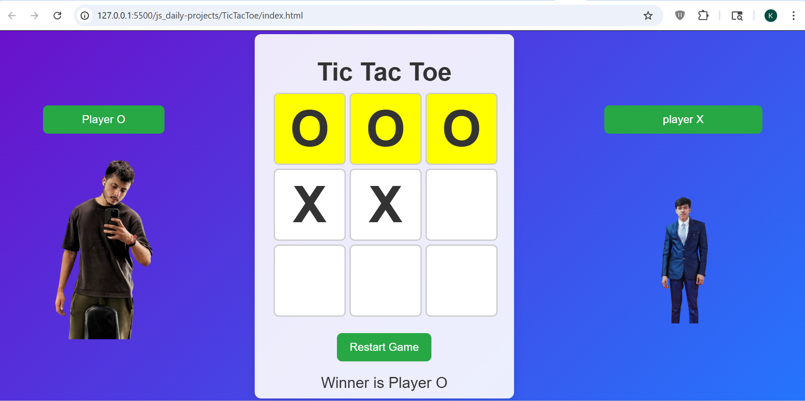

# Tic Tac Toe

## 📌 Description
The **Tic Tac Toe** is a frontend practice project built using **HTML, CSS, and JavaScript**.  
This project implements a classic two-player game where players take turns marking X and O on a grid to win.

It is a logic-based project focused on strengthening understanding of **game logic, state management, and DOM manipulation**.

---

## 🚀 Features
- Two-player gameplay (Player X vs Player O)
- Interactive 3x3 grid
- Turn-based game logic
- Winner detection system
- Restart game functionality
- Dynamic UI updates
- Custom player visuals

---

## 🛠️ Tech Stack
- HTML5  
- CSS3  
- JavaScript (Vanilla JS)

---

## 📸 Screenshots

### Screenshot 1

### Screenshot 2

---

## 🎬 Demo
Preview of the project:  
Video file:  
[Watch Demo](./assets/demoVideo.gif)

---

## ⚙️ How to Run the Project

1. Clone the repository  

2. Navigate to project folder  

3. Open `index.html` in browser  
(Double click or use Live Server)

---

## 📚 Learning Outcomes

- Learned how to implement **game logic using JavaScript**
- Practiced **state management for turns and board status**
- Improved understanding of **event handling**
- Strengthened **DOM manipulation skills**
- Gained experience in building **interactive applications**

---

## 🙏 Acknowledgement

This project was built with guidance and learning from:

- Rohit Negi (YouTube / teaching)
- Shradha Mam

---

## 🔮 Future Improvements

- Add single-player mode with AI
- Highlight winning combination
- Add score tracking system
- Improve UI animations
- Make it fully responsive

---