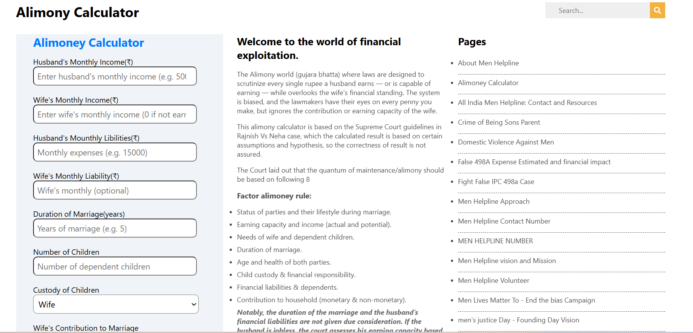

# Alimony Calculator

## 📌 Description
The **Alimony Calculator** is a frontend practice project built using **HTML, CSS, and JavaScript**.  
This project focuses on creating a structured UI layout and implementing basic calculation logic based on user input.

It is a clone-style project developed to strengthen core frontend development skills such as layout design, form handling, and DOM manipulation.

---

## 🚀 Features
- Clean and structured user interface
- Input fields for financial details
- Basic calculation logic using JavaScript
- Responsive layout (basic level)
- Organized sections (form, content, sidebar)
- Navigation bar UI design

---

## 🛠️ Tech Stack
- HTML5  
- CSS3  
- JavaScript (Vanilla JS)

---

---
## 📸 Screenshots

### Screenshot 1

### Screenshot 2

---

## 🎬 Demo
Preview of the project:
Video file:
[Watch Demo](./assets/demoVideo.gif)

---

## ⚙️ How to Run the Project

1. Clone the repository

2. Navigate to project folder

3. Open `index.html` in browser  
(Double click or use Live Server)

---

## 📚 Learning Outcomes

- Improved understanding of **HTML structure and layout planning**
- Better control over **CSS styling and positioning**
- Hands-on practice with **form handling**
- Learned **DOM manipulation using JavaScript**
- Experience in building **real-world UI clone projects**
- Understanding how to organize frontend project structure

---

## 🙏 Acknowledgement

This project was built with guidance and learning from:

- Rohit Negi (YouTube / teaching)
- Shradha Mam

---

## 🔮 Future Improvements

- Add advanced calculation logic
- Improve UI responsiveness for all devices
- Add validation for input fields
- Convert into a full-stack project (MERN integration)
- Enhance accessibility and UX

---