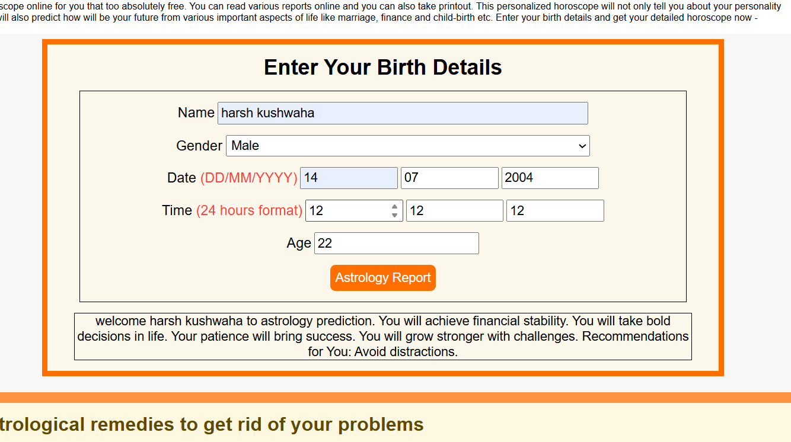
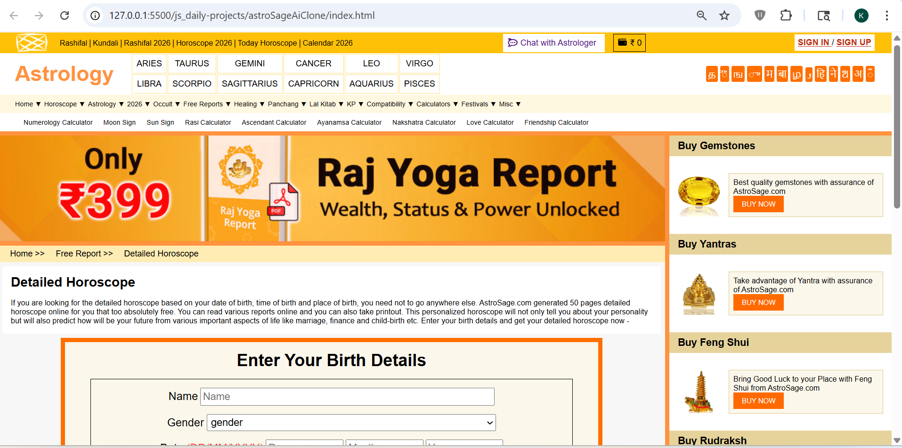

# AstroSage AI Clone

## 📌 Description
The **AstroSage AI Clone** is a frontend practice project built using **HTML, CSS, and JavaScript**.  
This project replicates a horoscope prediction interface where users enter birth details and receive a basic generated astrology report.

It is a clone-style project developed to improve frontend skills such as layout structuring, form handling, and dynamic content rendering.

---

## 🚀 Features
- Structured multi-section UI layout
- Form inputs for user birth details (name, gender, date, time, age)
- Basic horoscope prediction logic using JavaScript
- Dynamic result generation after form submission
- Sidebar UI elements and navigation layout
- Organized and responsive design (basic level)

---

## 🛠️ Tech Stack
- HTML5  
- CSS3  
- JavaScript (Vanilla JS)

---

## 📸 Screenshots

### Screenshot 1

### Screenshot 2

---

## 🎬 Demo
Preview of the project:  
Video file:  
[Watch Demo](./assets/demoVideo.mp4)

---

## ⚙️ How to Run the Project

1. Clone the repository  

2. Navigate to project folder  

3. Open `index.html` in browser  
(Double click or use Live Server)

---

## 📚 Learning Outcomes

- Improved understanding of **complex layout structuring**
- Learned handling of **multiple form inputs and grouped data**
- Practiced **JavaScript logic for dynamic predictions**
- Strengthened knowledge of **DOM manipulation**
- Experience in building **real-world clone UI projects**

---

## 🙏 Acknowledgement

This project was built with guidance and learning from:

- Rohit Negi (YouTube / teaching)
- Shradha Mam

---

## 🔮 Future Improvements

- Improve prediction logic with more accurate data handling
- Add form validation and error handling
- Enhance UI responsiveness for all devices
- Add API integration for real astrology data
- Convert into a full-stack MERN application

---