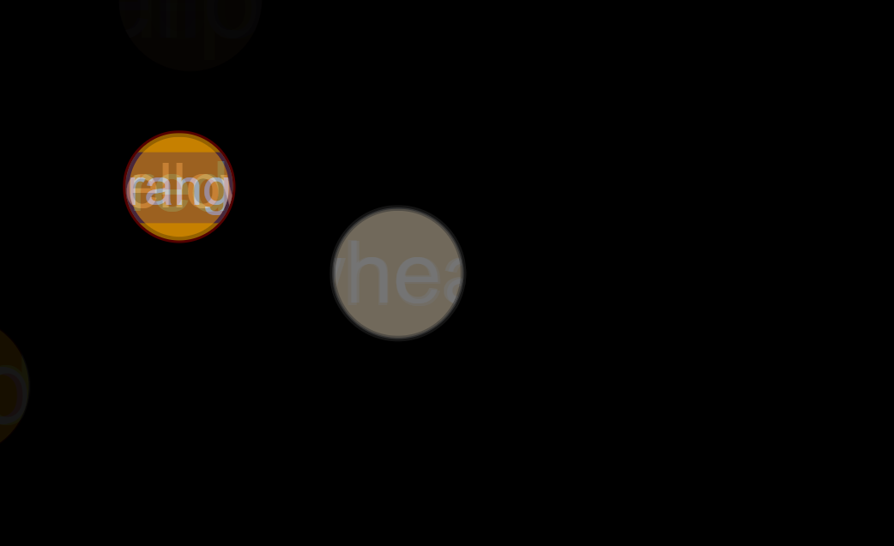

# Circle Generator

## 📌 Description
The **Circle Generator** is a frontend practice project built using **HTML, CSS, and JavaScript**.  
This project dynamically generates circles on the screen based on user interaction, helping to understand rendering, positioning, and DOM manipulation.

It is a logic-based mini project designed to improve understanding of dynamic UI updates and event-driven programming in JavaScript.

---

## 🚀 Features
- Dynamic circle generation on user interaction
- Random positioning of elements on the screen
- Styling and rendering using CSS
- Real-time DOM updates using JavaScript
- Interactive UI behavior
- Simple and clean layout

---

## 🛠️ Tech Stack
- HTML5  
- CSS3  
- JavaScript (Vanilla JS)

---

## 📸 Screenshots

### Screenshot 1

---

## 🎬 Demo
Preview of the project:  
Video file:  
[Watch Demo](./assets/demoVideo.mp4)

---

## ⚙️ How to Run the Project

1. Clone the repository  

2. Navigate to project folder  

3. Open `index.html` in browser  
(Double click or use Live Server)

---

## 📚 Learning Outcomes

- Learned how to create and append elements dynamically in the DOM
- Improved understanding of **event handling**
- Practiced **random value generation for positioning**
- Strengthened concepts of **CSS positioning (absolute/relative)**
- Built confidence in creating **interactive UI components**

---

## 🙏 Acknowledgement

This project was built with guidance and learning from:

- Rohit Negi (YouTube / teaching)
- Shradha Mam

---

## 🔮 Future Improvements

- Add animation effects while generating circles
- Allow user to control size and color of circles
- Add clear/reset functionality
- Improve responsiveness and layout control
- Convert into a small interactive game

---