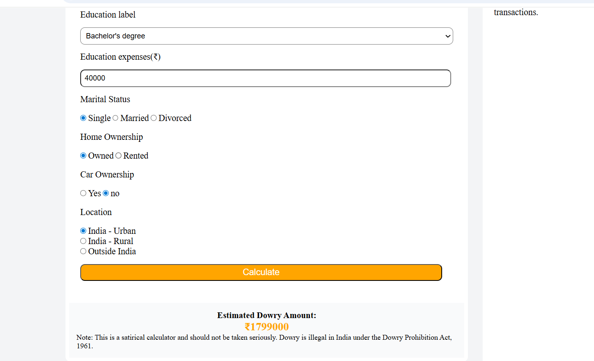
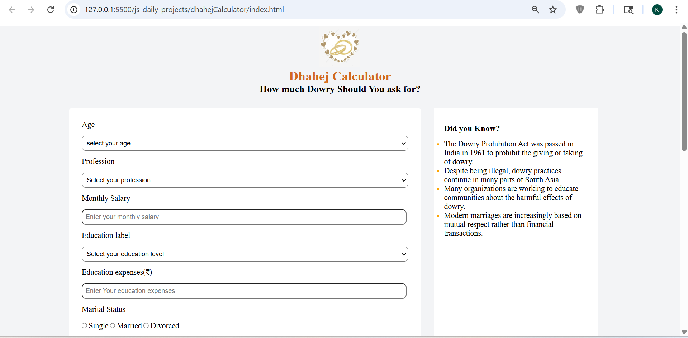

# Dhahej Calculator

## 📌 Description
The **Dhahej Calculator** is a frontend practice project built using **HTML, CSS, and JavaScript**.  
This project simulates a satirical dowry estimation system where users input personal and financial details to generate an estimated amount.

It is a logic-based project developed to improve skills in form handling, conditional logic, and dynamic UI updates.

---

## 🚀 Features
- Structured form with multiple input fields
- Inputs include age, profession, salary, education, and more
- Radio button and dropdown-based selections
- Dynamic calculation using JavaScript
- Result display with estimated amount
- Informational sidebar section
- Clean and organized layout

---

## 🛠️ Tech Stack
- HTML5  
- CSS3  
- JavaScript (Vanilla JS)

---

## 📸 Screenshots

### Screenshot 1

### Screenshot 2

---

## 🎬 Demo
Preview of the project:  
Video file:  
[Watch Demo](./assets/demoVideo.gif)

---

## ⚙️ How to Run the Project

1. Clone the repository  

2. Navigate to project folder  

3. Open `index.html` in browser  
(Double click or use Live Server)

---

## 📚 Learning Outcomes

- Learned handling of **complex form inputs and user data**
- Improved understanding of **conditional logic in JavaScript**
- Practiced **DOM manipulation and dynamic result rendering**
- Gained experience in building **interactive calculation-based UI**
- Strengthened layout structuring and form design skills

---

## 🙏 Acknowledgement

This project was built with guidance and learning from:

- Rohit Negi (YouTube / teaching)
- Shradha Mam

---

## 🔮 Future Improvements

- Add proper input validation and error handling
- Improve UI responsiveness for mobile devices
- Enhance calculation logic with more parameters
- Add reset and edit functionality
- Convert into a full-stack application with data storage

---