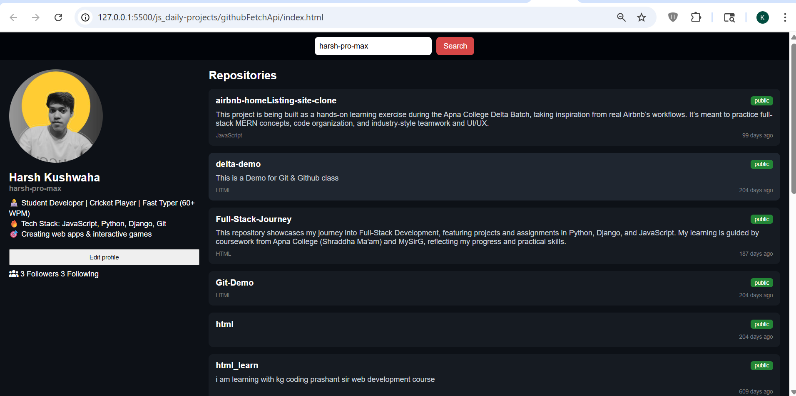

# GitHub Fetch API

## 📌 Description
The **GitHub Fetch API** project is a frontend practice project built using **HTML, CSS, and JavaScript**.  
This project allows users to enter a GitHub username and fetch real-time profile data using the GitHub API.

It is a practical project focused on learning API integration, asynchronous JavaScript, and dynamic UI updates.

---

## 🚀 Features
- Input field to enter GitHub username
- Fetch user data from GitHub API
- Display profile details (name, avatar, bio, etc.)
- Real-time data rendering using JavaScript
- Error handling for invalid usernames
- Clean and minimal UI design

---

## 🛠️ Tech Stack
- HTML5  
- CSS3  
- JavaScript (Vanilla JS)

---

## 📸 Screenshots

### Screenshot 1

---

## 🎬 Demo
Preview of the project:  
Video file:  
[Watch Demo](./assets/demoVideo.gif)

---

## ⚙️ How to Run the Project

1. Clone the repository  

2. Navigate to project folder  

3. Open `index.html` in browser  
(Double click or use Live Server)

---

## 📚 Learning Outcomes

- Learned how to work with **Fetch API**
- Understood **asynchronous JavaScript (Promises / async-await)**
- Practiced handling **API responses and JSON data**
- Improved skills in **DOM manipulation with dynamic data**
- Learned basic **error handling in API calls**

---

## 🙏 Acknowledgement

This project was built with guidance and learning from:

- Rohit Negi (YouTube / teaching)
- Shradha Mam

---

## 🔮 Future Improvements

- Add loading spinner while fetching data
- Improve UI/UX design
- Display repositories and followers data
- Add search history feature
- Convert into a full-stack app with caching

---