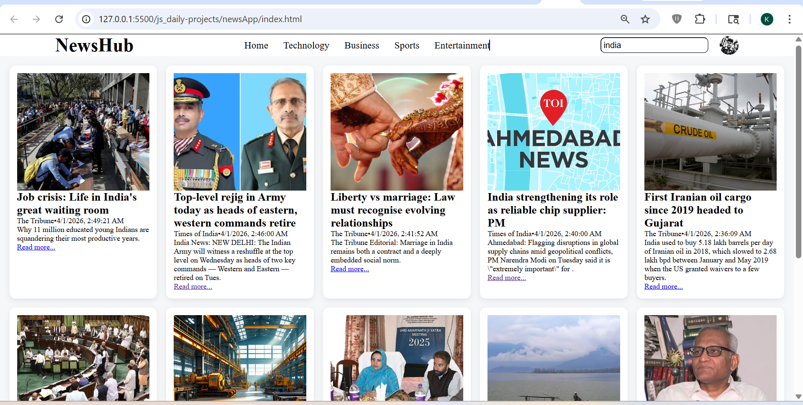

# News App

## 📌 Description
The **News App** is a frontend practice project built using **HTML, CSS, and JavaScript**.  
This project fetches real-time news data from an API and displays it in a structured card layout.

It is designed to strengthen understanding of API integration, asynchronous JavaScript, and dynamic DOM manipulation.

---

## 🚀 Features
- Fetch real-time news data from API
- Display news articles in card layout
- Dynamic content rendering using JavaScript
- Image, title, and description display for each news card
- Clean and responsive UI design
- Efficient DOM manipulation

---

## 🛠️ Tech Stack
- HTML5  
- CSS3  
- JavaScript (Vanilla JS)

---

## 📸 Screenshots

### Screenshot 1

### Screenshot 2

---

## 🎬 Demo
Preview of the project:  
Video file:  
[Watch Demo](./assets/demoVideo.gif)

---

## ⚙️ How to Run the Project

1. Clone the repository  

2. Navigate to project folder  

3. Open `index.html` in browser  
(Double click or use Live Server)

---

## 📚 Learning Outcomes

- Learned how to integrate and work with **external APIs**
- Improved understanding of **Fetch API and async operations**
- Strengthened **DOM manipulation skills**
- Practiced creating **dynamic card-based layouts**
- Gained experience in handling **real-time data rendering**

---

## 🙏 Acknowledgement

This project was built with guidance and learning from:

- Rohit Negi (YouTube / teaching)
- Shradha Mam

---

## 🔮 Future Improvements

- Add category-based filtering (technology, sports, etc.)
- Implement search functionality
- Add loading spinner for better UX
- Improve responsiveness for mobile devices
- Add pagination or infinite scroll

---