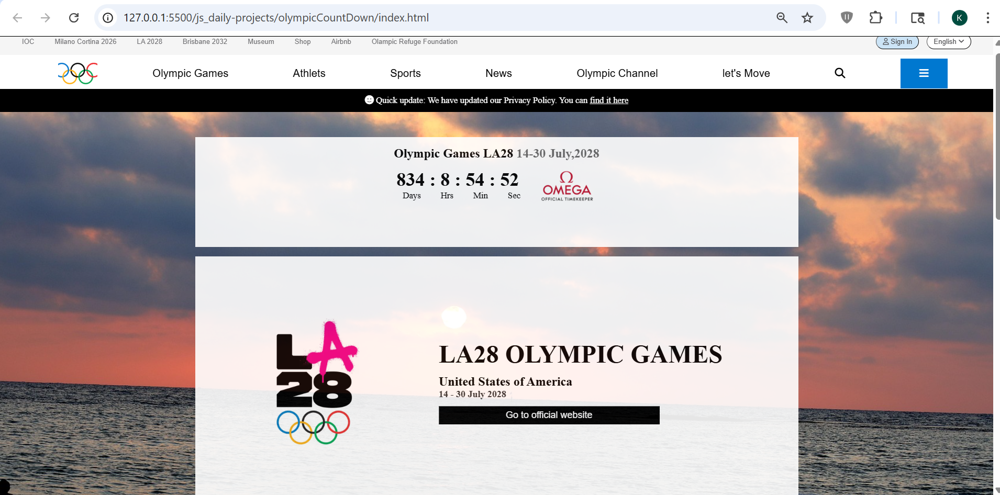

# Olympic Countdown

## 📌 Description
The **Olympic Countdown** is a frontend practice project built using **HTML, CSS, and JavaScript**.  
This project displays a live countdown timer for an upcoming event (LA28 Olympic Games), calculated using JavaScript date objects.

It is designed to strengthen understanding of **Date objects, time calculations, and real-time UI updates**.

---

## 🚀 Features
- Live countdown timer (days, hours, minutes, seconds)
- Uses JavaScript Date object for time calculation
- Dynamic UI updates every second
- Structured layout inspired by real-world website
- Event-based countdown logic
- Clean and responsive UI (basic level)

---

## 🛠️ Tech Stack
- HTML5  
- CSS3  
- JavaScript (Vanilla JS)

---

## 📸 Screenshots

### Screenshot 1

---

## 🎬 Demo
Preview of the project:  
Video file:  
[Watch Demo](./assets/demoVideo.gif)

---

## ⚙️ How to Run the Project

1. Clone the repository  

2. Navigate to project folder  

3. Open `index.html` in browser  
(Double click or use Live Server)

---

## 📚 Learning Outcomes

- Learned how to use **JavaScript Date object**
- Understood **time difference calculations**
- Practiced **setInterval for real-time updates**
- Improved skills in **DOM manipulation**
- Gained experience in building **event-based UI features**

---

## 🙏 Acknowledgement

This project was built with guidance and learning from:

- Rohit Negi (YouTube / teaching)
- Shradha Mam

---

## 🔮 Future Improvements

- Add multiple event countdown options
- Improve UI animations and transitions
- Add timezone support
- Allow user to set custom countdown events
- Convert into a reusable countdown component

---