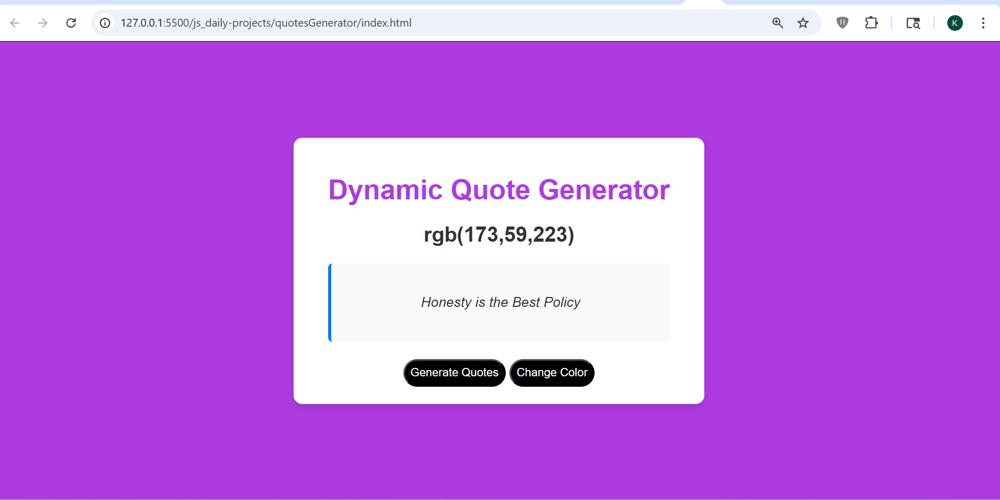

# Quotes Generator

## 📌 Description
The **Quotes Generator** is a frontend practice project built using **HTML, CSS, and JavaScript**.  
This project generates random quotes dynamically and also changes background colors to enhance visual interaction.

It is a beginner-friendly project created during JavaScript revision to strengthen core concepts like DOM manipulation and event handling.

---

## 🚀 Features
- Generate random quotes on button click
- Dynamic background color change
- Display RGB color value
- Interactive UI with buttons
- Real-time DOM updates
- Simple and clean card layout

---

## 🛠️ Tech Stack
- HTML5  
- CSS3  
- JavaScript (Vanilla JS)

---

## 📸 Screenshots

### Screenshot 1

---

## 🎬 Demo
Preview of the project:  
Video file:  
[Watch Demo](./assets/demoVideo.gif)

---

## ⚙️ How to Run the Project

1. Clone the repository  

2. Navigate to project folder  

3. Open `index.html` in browser  
(Double click or use Live Server)

---

## 📚 Learning Outcomes

- Learned basics of **JavaScript DOM manipulation**
- Practiced **event handling (click events)**
- Understood **random value generation**
- Improved control over **dynamic UI updates**
- Built foundation for more advanced JS projects

---

## 🙏 Acknowledgement

This project was built with guidance and learning from:

- Rohit Negi (YouTube / teaching)
- Shradha Mam

---

## 🔮 Future Improvements

- Add API-based quotes instead of static data
- Add copy-to-clipboard functionality
- Add animation effects
- Improve UI/UX design
- Add category-based quote filtering

---