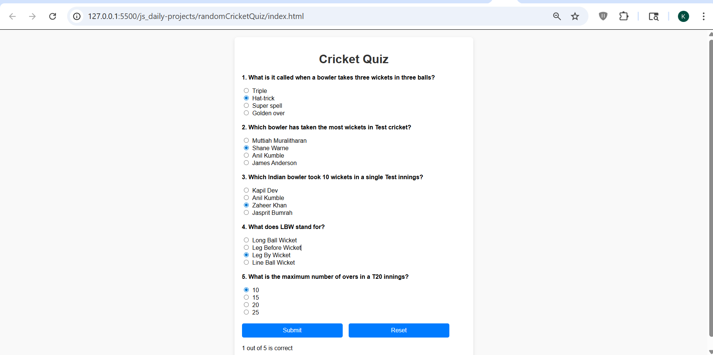

# Cricket Quiz

## 📌 Description
The **Cricket Quiz** is a frontend practice project built using **HTML, CSS, and JavaScript**.  
This project presents multiple-choice questions related to cricket and calculates the user's score based on selected answers.

It is a beginner-level project focused on understanding **arrays, conditional logic, and form handling in JavaScript**.

---

## 🚀 Features
- Multiple-choice quiz questions
- Radio button selection for answers
- Score calculation on submission
- Reset functionality to restart quiz
- Simple and clean UI layout
- Instant result display

---

## 🛠️ Tech Stack
- HTML5  
- CSS3  
- JavaScript (Vanilla JS)

---

## 📸 Screenshots

### Screenshot 1

---

## 🎬 Demo
Preview of the project:  
(Video can be added later if available)

---

## ⚙️ How to Run the Project

1. Clone the repository  

2. Navigate to project folder  

3. Open `index.html` in browser  
(Double click or use Live Server)

---

## 📚 Learning Outcomes

- Learned how to use **arrays for storing questions and answers**
- Practiced **conditional logic for answer checking**
- Improved understanding of **form input handling**
- Strengthened **DOM manipulation skills**
- Built foundation for creating **quiz-based applications**

---

## 🙏 Acknowledgement

This project was built with guidance and learning from:

- Rohit Negi (YouTube / teaching)
- Shradha Mam

---

## 🔮 Future Improvements

- Add dynamic question loading
- Improve UI/UX design
- Add timer functionality
- Store scores using local storage
- Convert into a category-based quiz system

---