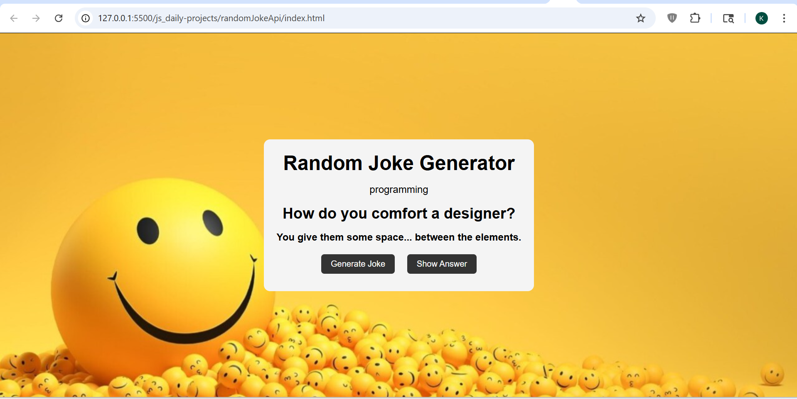

# Random Joke API

## 📌 Description
The **Random Joke API** project is a frontend practice project built using **HTML, CSS, and JavaScript**.  
This project fetches random jokes from an external API and displays them dynamically on the UI.

It is designed to strengthen understanding of **API integration, asynchronous JavaScript, and dynamic content rendering**.

---

## 🚀 Features
- Fetch random jokes using API
- Display joke question and answer
- Separate button to reveal answer
- Dynamic UI updates
- Clean and interactive layout
- Background styling with visual elements

---

## 🛠️ Tech Stack
- HTML5  
- CSS3  
- JavaScript (Vanilla JS)

---

## 📸 Screenshots

### Screenshot 1

---

## 🎬 Demo
Preview of the project:  
Video file:  
[Watch Demo](./assets/demoVideo.mp4)

---

## ⚙️ How to Run the Project

1. Clone the repository  

2. Navigate to project folder  

3. Open `index.html` in browser  
(Double click or use Live Server)

---

## 📚 Learning Outcomes

- Learned how to work with **external APIs**
- Practiced **Fetch API and async-await**
- Improved understanding of **handling API response data**
- Strengthened **DOM manipulation skills**
- Learned how to manage **UI state (question vs answer)**

---

## 🙏 Acknowledgement

This project was built with guidance and learning from:

- Rohit Negi (YouTube / teaching)
- Shradha Mam

---

## 🔮 Future Improvements

- Add loading indicator while fetching joke
- Add category-based joke filtering
- Improve UI animations
- Add copy/share functionality
- Store favorite jokes using local storage

---