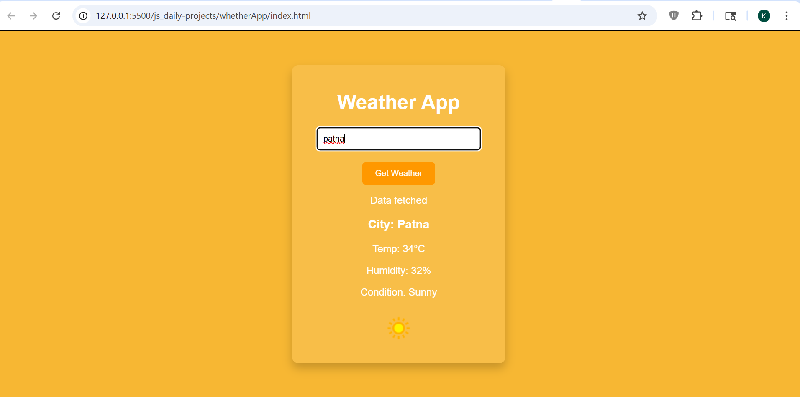

# Weather App

## 📌 Description
The **Weather App** is a frontend practice project built using **HTML, CSS, and JavaScript**.  
This project fetches real-time weather data from an external API based on the city entered by the user and displays key weather details.

It is designed to strengthen understanding of **API integration, asynchronous JavaScript, and dynamic UI updates**.

---

## 🚀 Features
- Search weather by city name
- Fetch real-time weather data using API
- Display temperature, humidity, and condition
- Dynamic weather icon based on condition
- Clean and responsive card-based UI
- Real-time DOM updates

---

## 🛠️ Tech Stack
- HTML5  
- CSS3  
- JavaScript (Vanilla JS)

---

## 📸 Screenshots

### Screenshot 1

---

## 🎬 Demo
Preview of the project:  
Video file:  
[Watch Demo](./assets/demoVideo.mp4)

---

## ⚙️ How to Run the Project

1. Clone the repository  

2. Navigate to project folder  

3. Open `index.html` in browser  
(Double click or use Live Server)

---

## 📚 Learning Outcomes

- Learned how to work with **weather APIs**
- Practiced **Fetch API and async-await**
- Improved understanding of **handling JSON response data**
- Strengthened **DOM manipulation skills**
- Learned how to update UI based on dynamic data

---

## 🙏 Acknowledgement

This project was built with guidance and learning from:

- Rohit Negi (YouTube / teaching)
- Shradha Mam

---

## 🔮 Future Improvements

- Add location-based weather (geolocation)
- Improve UI/UX design
- Add forecast (next 5 days)
- Add loading and error handling states
- Convert into a full-stack weather dashboard

---