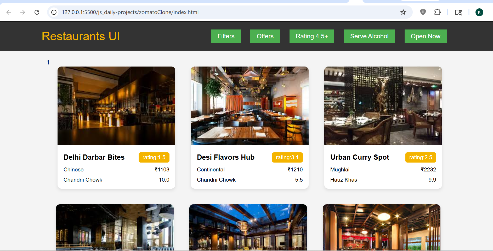

# Zomato Clone UI

## 📌 Description
The **Zomato Clone UI** is a frontend practice project built using **HTML, CSS, and JavaScript**.  
This project simulates a restaurant listing interface where data is fetched and displayed in a card-based layout.

It focuses on improving skills in **API/data handling, DOM manipulation, and UI structuring**.

---

## 🚀 Features
- Display restaurant data in card layout
- Dynamic rendering using JavaScript
- Restaurant details (name, cuisine, location, price, rating)
- Filter buttons UI (rating, offers, etc.)
- Clean and modern UI design
- Grid-based responsive layout

---

## 🛠️ Tech Stack
- HTML5  
- CSS3  
- JavaScript (Vanilla JS)

---

## 📸 Screenshots

### Screenshot 1

---

## 🎬 Preview of the project:  
Video file:  
[Watch Demo](./assets/demoVideo.mp4)

---

## ⚙️ How to Run the Project

1. Clone the repository  

2. Navigate to project folder  

3. Open `index.html` in browser  
(Double click or use Live Server)

---

## 📚 Learning Outcomes

- Learned how to render **data-driven UI**
- Improved understanding of **array mapping and data handling**
- Practiced **DOM manipulation for card generation**
- Built experience in **UI cloning and layout design**
- Strengthened logic for **filter-based UI structure**

---

## 🙏 Acknowledgement

This project was built with guidance and learning from:

- Rohit Negi (YouTube / teaching)
- Shradha Mam

---

## 🔮 Future Improvements

- Add real API integration
- Implement working filters and search
- Add sorting functionality
- Improve responsiveness for all devices
- Convert into full-stack application

---